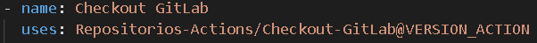
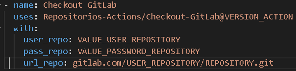
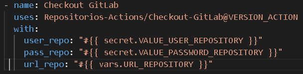

# Checkout GitLab

Actions para facilitar el checkout a un repositorio GitLab.

## ¿Que es Checkout-GitLab?

Checkout-GitLab es un action que permite el clonado de un repositorio GitLab solo requiere 3 parametros de entrada.

	Usuario del repositorio.
	Contraseña del repositorio.
	URL del repositorio. IMPORTANTE no debes colocar el "https://".

## Instrucciones

1. Copiar el llamado del action en el maketplace de GitHub. Recomendamos usar siempre la ultima versión.

Ejemplo:

  

2. Pega en tu workflow y añade la etiqueta with: añadiendo los parametros: user_repo:, pass_repo: y  url_repo:.

Ejemplo:

  

Se debe indicar el valores que corresponden. Nota: se puedes colocar los valores directos otra forma de trabajar es variabilizar los valores.

Ejemplo 2:

  

## Limitaciones

De momento solo se realizaron pruebas con repositorios GitLab. No se descarta su compatibiliad con otras compañias.